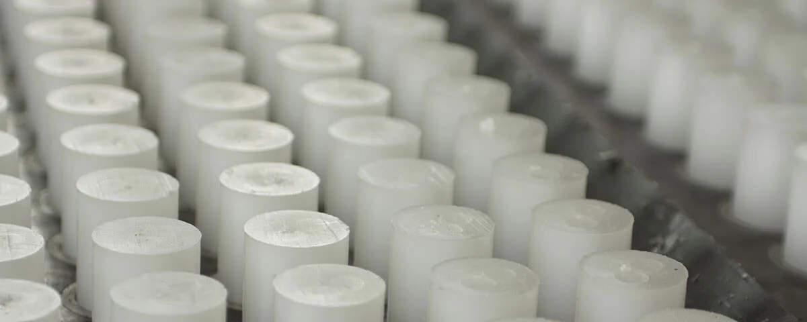

# Projeto Alvaluz

Projeto de um site institucional/e-commerce para uma loja de velas chamado **Alvaluz**, desenvolvido com **HTML, CSS e JavaScript**.

---

## Estrutura do Projeto

```bash
📦 alvaluz
 ┣ 📜 index.html
 ┣ 📜 style.css
 ┣ 📜 script.js
 ┣ 🖼️ logo.png
 ┣ 🖼️ fabrica.webp
```

---

# 🧱 1. HTML (Estrutura)

O arquivo `index.html` define toda a estrutura do site.

---

## Header

### `#headerNav`

* Botão menu (☰)
* Logo
* Campo de busca
* Ícones (carrinho + usuário)

### `#headerLinks`

* Home
* Catálogo
* Contato (WhatsApp)

---

## Aside (Menu Lateral)

* Menu oculto inicialmente
* Abre ao clicar no botão ☰
* Contém:

  * Home
  * Velas (submenu)
  * Contato

---

## Submenu "Velas"

Categorias:

* Clássicas
* Aromatizantes
* Religiosas

---

## Banner

Imagem principal do site:

```html
<section id="banner">
  
</section>
```

---

## Outras Seções

* `#categorias` → futuras categorias
* `#carrosel` → futuro slider
* `#sobre` → produtos ou informações

---

## Footer

* Contatos
* Redes sociais

---

# 🎨 2. CSS (Estilização)

Arquivo: `style.css`

---

## Reset Global

```css
* {
  margin: 0;
  padding: 0;
  font-family: Arial, Helvetica, sans-serif;
}
```

---

## Header com Gradiente

```css
header {
  background: radial-gradient(circle,
    rgba(187, 216, 237, 1) 0%,
    rgba(131, 205, 235, 1) 100%);
}
```

---

## Layout com Flexbox

```css
#headerNav {
  display: flex;
  justify-content: space-between;
  align-items: center;
}
```

---

## Campo de Busca

```css
input {
  width: 31rem;
  border-radius: 10px;
  border: none;
}
```

---

## Menu Lateral

```css
aside {
  transform: translateX(-100%);
  transition: transform 0.3s ease;
}

aside.ativo {
  transform: translateX(0);
}
```

---

## Submenu Animado

```css
#catalogoToggle {
  max-height: 0;
  overflow: hidden;
}

#catalogoToggle.ativo {
  max-height: 300px;
}
```

---

## Efeitos Hover

```css
.headerLink:hover,
.icon:hover {
  color: #fff;
}
```

---

## Ícones

* Biblioteca: Flaticon

```css
.icon {
  font-size: 1.3rem;
}
```

---

## Animação do Ícone

```css
#iconeVelas.ativo {
  transform: rotate(90deg);
}
```

---

# ⚙️ 3. JavaScript (Interatividade)

Arquivo: `script.js`

---

## Inicialização

```js
document.addEventListener("DOMContentLoaded", function () {
```

Garante que o DOM esteja carregado antes de executar.

---

## Seleção de Elementos

```js
const item = document.getElementById("itemCatalogo");
const menu = document.getElementById("catalogoToggle");
const icone = document.getElementById("iconeVelas");

const aside = document.querySelector("aside");
const botaoAside = document.getElementById("botaoAside");
const botaoFecharAside = document.getElementById("botaoFecharAside");
```

---

## Toggle do Submenu

```js
item.addEventListener("click", function (e) {
  e.preventDefault();

  if (menu.style.maxHeight && menu.style.maxHeight !== "0px") {
    menu.style.maxHeight = "0px";
    icone.classList.remove("ativo");
  } else {
    menu.style.maxHeight = menu.scrollHeight + "px";
    icone.classList.add("ativo");
  }
});
```

### O que faz:

* Abre/fecha o submenu
* Anima altura dinamicamente
* Rotaciona o ícone

---

## Abrir Menu Lateral

```js
botaoAside.addEventListener("click", function () {
  aside.classList.add("ativo");
});
```

---

## Fechar Menu Lateral

```js
botaoFecharAside.addEventListener("click", function () {
  aside.classList.remove("ativo");
});
```

---

# Funcionalidades

* Menu lateral animado
* Submenu expansível
* Rotação de ícone
* Layout moderno
* Estrutura pronta para e-commerce

---

# Fluxo de Uso

| Ação              | Resultado         |
| ----------------- | ----------------- |
| Clique no ☰       | Abre menu lateral |
| Clique no ❌       | Fecha menu        |
| Clique em "Velas" | Abre submenu      |
| Clique novamente  | Fecha submenu     |

---

# Melhorias Futuras

* Responsividade mobile
* Carrossel funcional
* Sistema de busca
* Backend (produtos reais)
* Carrinho de compras

---

# Tecnologias Utilizadas

* HTML5
* CSS3
* JavaScript
* Flaticon Icons

---

# Autores

Desenvolvido por Pedro Henrique Venancio Meireles 10747973, Brenner da Silva Costa 10754397, Giovanni Manchi Sodré 10753281, Leonardo Guedes Serra Santana 10738007.
